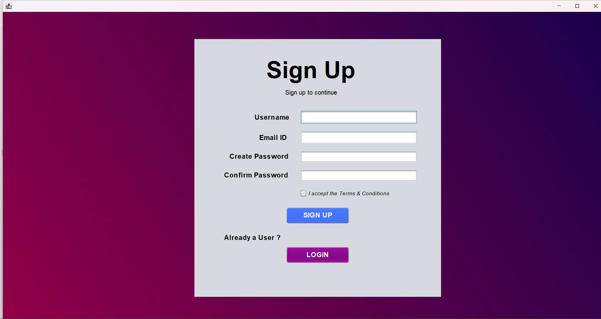
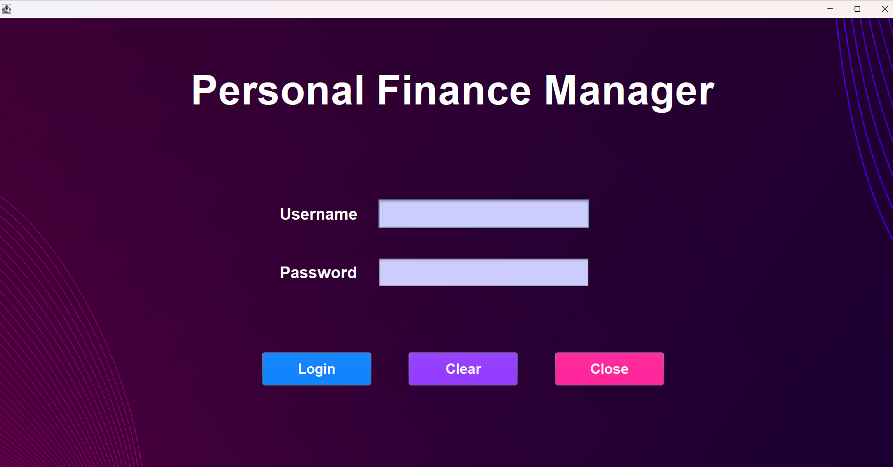
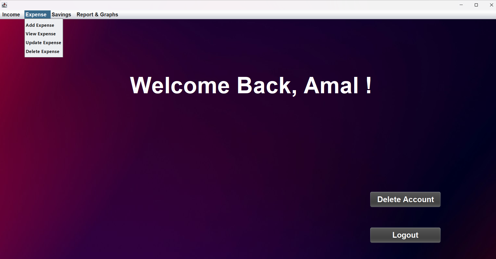
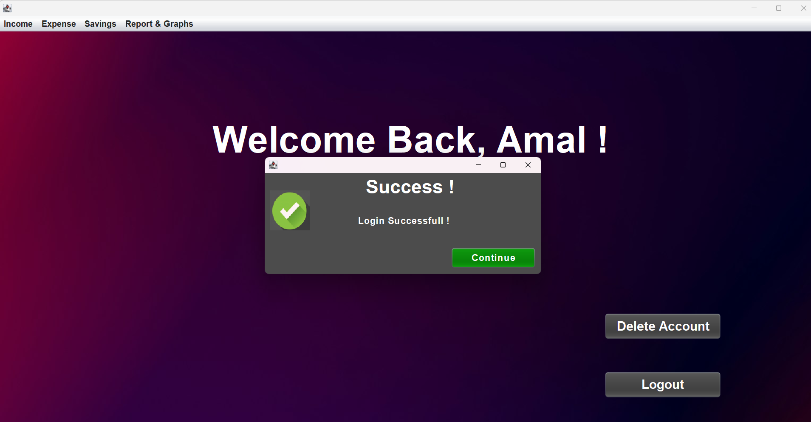
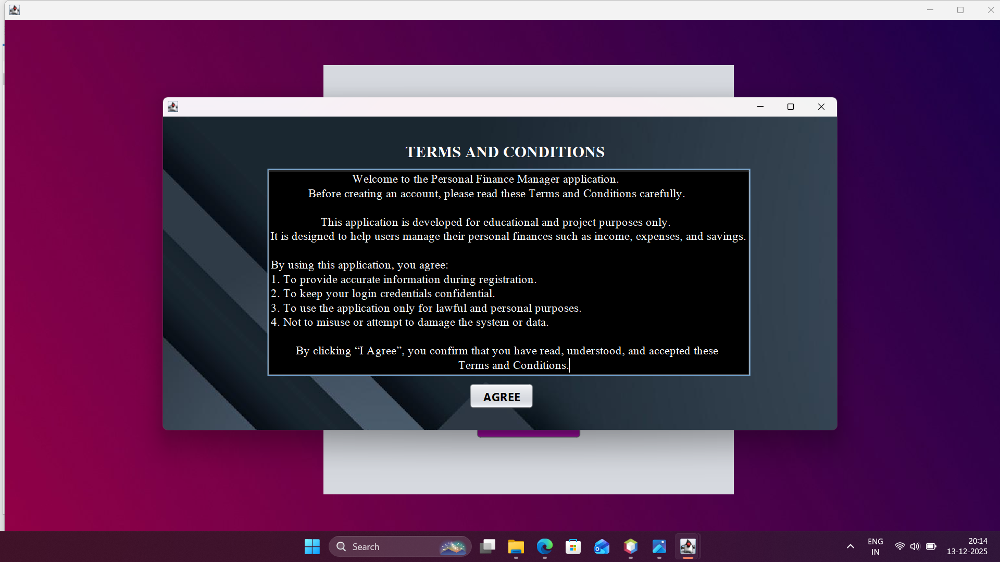
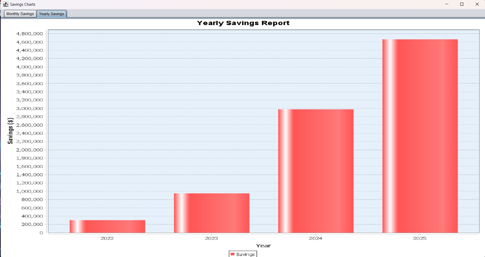
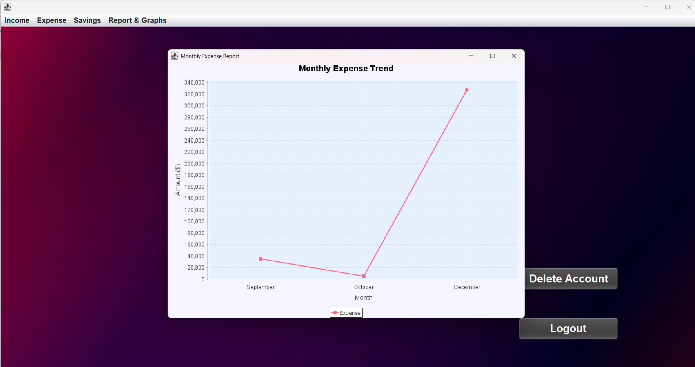

<h1 align ="center"> <b>Personal Finance Management System </b></h1>

A simple personal finance management application developed as part of the Object-Oriented Programming Principles in Java academic course. This project demonstrates core OOP concepts, JavaSwing-based UI development, and MySQL database integration using NetBeans IDE.

<h2><b>📌Project Overview</b></h2>

This application helps users manage their personal finances by tracking income, expenses, savings, and reports through a clean desktop-based interface. The project focuses on applying object-oriented design principles and database connectivity in a real-world use case.

<h2><b>🎯 Objectives</b></h2>

-  Apply Object-Oriented Programming (OOP) principles in Java

-  Build a desktop GUI using JavaSwing

-  Integrate MySQL database using JDBC

-  Demonstrate CRUD operations in a finance-based application

-  Gain hands-on experience with NetBeans IDE

## 🛠️ Tech Stack
<div align = "center">
  


</div>

## ✨ Features
-  User authentication (login/signup)

-  Income management

-  Expense tracking

-  Savings overview

-  Financial reports

-  MySQL-backed persistent storage

## 📸Screenshots

<div align = "center">
  







  
</div>

## ⚙️Setup & Installation

#### 1. Clone the repository:
```bash
git clone https://github.com/Amal-nellanhi/Personal-Finance-Management-Project.git
```

#### 2. Open the project in NetBeans IDE


#### 3. Configure MySQL database:

  -  Create a new database
  -  Import the provided SQL file (if available)
  -  Update database credentials in the Java source code

#### 4. Add MySQL JDBC Driver to the project libraries


#### 5. Run the project from NetBeans

## 📄 License

This project is licensed under the MIT License. See the [LICENSE](LICENSE) file for details.

## 🌟 Why This Project Matters

- **Brings classroom theory to life**  
  This isn’t just another coding assignment — it’s a real-world application that shows how **Object-Oriented Programming principles** translate into practical software people can use.

- **Hands-on with industry tools**  
  By combining **Java Swing** for the interface and **MySQL with JDBC** for persistence, the project mirrors the stack used in enterprise desktop applications, making it a strong portfolio piece.

- **Empowers financial literacy**  
  Managing income, expenses, and savings is a universal need. This app demonstrates how technology can help individuals take control of their personal finances.

- **End-to-end development experience**  
  From designing GUIs to structuring databases and implementing CRUD operations, the project covers the full spectrum of software development — a valuable skill set for any aspiring engineer.

- **Scalable foundation for growth**  
  With a layered architecture (models, repositories, services, views, controllers), the system is designed to evolve. Features like budgeting, recurring transactions, or exportable reports can be added seamlessly.

> Developed solely for academic learning and demonstration purposes.


